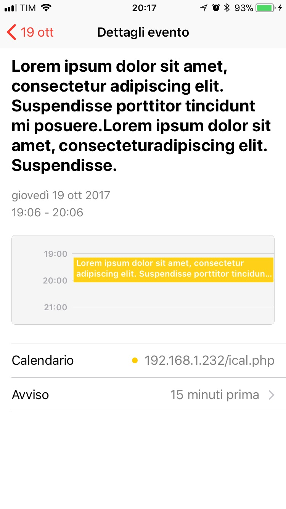

# PHPiCal
This is a basic class used to create a compliant iCalendar ([RFC 5545](http://tools.ietf.org/html/rfc5545)). The support for the standard is very basic because the main purpose of the project is to create a simple way for PHP developers to create an iCalendar out of a list of events. The output of the first snippet (below) on an iPhone, iOS 11 looks like this:

## Installation
Simply download `ical.php` and `require` it.
## Usage
Here it is a script:
```php
require('ical.php');
$cal=new iCalendar();
header("Content-Type: text/calendar");
echo $cal->ical(json_decode('[{"start":1508432795,"end":1508436395,"desc":"Lorem ipsum dolor sit amet, consectetur adipiscing elit. Suspendisse porttitor tincidunt mi posuere.Lorem ipsum dolor sit amet, consectetur adipiscing elit. Suspendisse."}]',true));
```
If you want to change the alarm for the event (the default value is 15 minutes before the event starts), you just have to supply the class constructor the number of seconds before the event starts the alarm should fire.
For example, `$cal=new iCalendar(60);` means that the alarm should fire a minute before the event starts.

The main method of the class is `ical()`, which accepts only one parameter, an array of associative arrays with the following structure (below in JSON for better readability, but a PHP array of associative array **must** be passed):
```json
[
    {
        "start":int,
        "end":int,
        "desc":text
    }
]
```
### Parameters
* `start` is the [timestamp](https://en.wikipedia.org/wiki/Unix_time) of the event start date
* `end` is the timestamp of the event end date
* `desc` is the event description